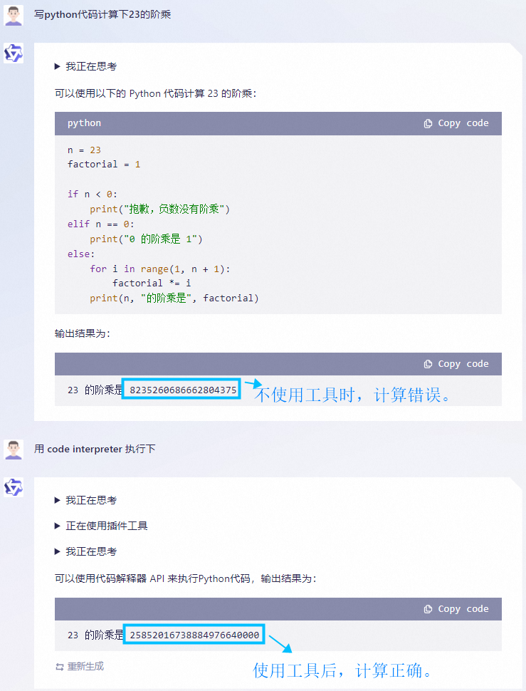
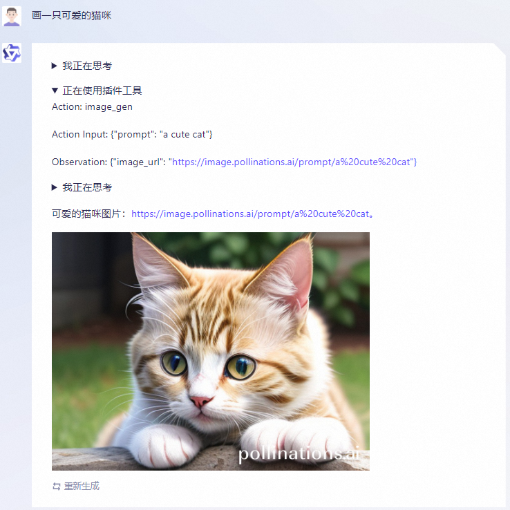

---
language:
- zh
- en
tags:
- qwen
pipeline_tag: text-generation
---

# Qwen-7B-Chat

<p align="center">
    
<p>

<p align="center">
        ModelScope[Base|Chat]&nbsp ｜ &nbspHuggingface[Base|Chat]&nbsp ｜ &nbspDemo&nbsp ｜ &nbspReport
</p>
<br><br>

## 介绍（Introduction）

通义千问-7B（`Qwen-7B`） 是阿里云研发的通义千问大模型系列的70亿参数规模的模型。`Qwen-7B`是基于Transformer的大语言模型, 在超大规模的预训练数据上进行训练得到。预训练数据类型多样，覆盖广泛，包括大量网络文本、专业书籍、代码等。同时，在`Qwen-7B`的基础上，我们使用对齐机制打造了基于大语言模型的AI助手`Qwen-7B-Chat`。本仓库为`Qwen-7B-Chat`的仓库。

如果您想了解更多关于通义千问-7B开源模型的细节，我们建议您参阅Github代码库。

`Qwen-7B` is the 7B-parameter version of the large language model series, Qwen (abbr. of Tongyi Qianwen), proposed by Aibaba Cloud. `Qwen-7B` is a Transformer-based large language model, which is pretrained on a large volume of data, including web texts, books, codes, etc. Additionally, based on the pretrained `Qwen-7B`, we release `Qwen-7B-Chat`, a large-model-based AI assistant, which is trained with alignment techniques. This repository is the one for `Qwen-7B-Chat`.

For more details about the open-source model of Qwen-7B, please refer to the Github code repository.

## 依赖项（Dependency）

运行`Qwen-7B-Chat`，请确保机器环境pytorch版本不低于1.12，再执行以下pip命令安装依赖库

To run `Qwen-7B-Chat`, please make sure that pytorch version is not lower than 1.12, and then execute the following pip commands to install the dependency libraries.

```bash
pip install transformers==4.31.0 accelerate tiktoken einops
```

另外，推荐安装`flash-attention`库，以实现更高的效率和更低的显存占用。

In addition, it is recommended to install the `flash-attention` library for higher efficiency and lower memory usage.

```bash
git clone -b v1.0.8 https://github.com/Dao-AILab/flash-attention
cd flash-attention && pip install .
pip install csrc/layer_norm
pip install csrc/rotary
```

## 快速使用（Quickstart）

下面我们展示了一个使用`Qwen-7B-Chat`模型，进行多轮对话交互的样例：

We show an example of multi-turn interaction with `Qwen-7B-Chat` in the following code:

```ipython
>>> from transformers import AutoModelForCausalLM, AutoTokenizer
>>> from transformers.generation import GenerationConfig

>>> tokenizer = AutoTokenizer.from_pretrained("Qwen/Qwen-7B-Chat", trust_remote_code=True)
>>> model = AutoModelForCausalLM.from_pretrained("Qwen/Qwen-7B-Chat", device_map="auto", trust_remote_code=True).eval()
>>> model.generation_config = GenerationConfig.from_pretrained("Qwen/Qwen-7B-Chat", trust_remote_code=True) # 可指定不同的生成长度、top_p等相关超参

>>> # 第一轮对话 1st dialogue turn
>>> response, history = model.chat(tokenizer, "你好", history=None)
>>> print(response)
你好！很高兴为你提供帮助。
>>> # 第二轮对话 2nd dialogue turn
>>> response, history = model.chat(tokenizer, "给我讲一个年轻人奋斗创业最终取得成功的故事。", history=history) 
>>> print(response)
这是一个关于一个年轻人奋斗创业最终取得成功的故事。

故事的主人公叫李明，他来自一个普通的家庭，父母都是普通的工人。从小，李明就立下了一个目标：要成为一名成功的企业家。

为了实现这个目标，李明勤奋学习，考上了大学。在大学期间，他积极参加各种创业比赛，获得了不少奖项。他还利用课余时间去实习，积累了宝贵的经验。

毕业后，李明决定开始自己的创业之路。他开始寻找投资机会，但多次都被拒绝了。然而，他并没有放弃。他继续努力，不断改进自己的创业计划，并寻找新的投资机会。

最终，李明成功地获得了一笔投资，开始了自己的创业之路。他成立了一家科技公司，专注于开发新型软件。在他的领导下，公司迅速发展起来，成为了一家成功的科技企业。

李明的成功并不是偶然的。他勤奋、坚韧、勇于冒险，不断学习和改进自己。他的成功也证明了，只要努力奋斗，任何人都有可能取得成功。
>>> # 第三轮对话 3rd dialogue turn
>>> response, history = model.chat(tokenizer, "给这个故事起一个标题", history=history)
>>> print(response)
《奋斗创业：一个年轻人的成功之路》
```

关于更多的使用说明，请参考我们的Github repo获取更多信息。

For more information, please refer to our Github repo for more information.

## 模型细节（Model）

与`Qwen-7B`预训练模型相同，`Qwen-7B-Chat`模型规模基本情况如下所示

The details of the model architecture of `Qwen-7B-Chat` are listed as follows

| Hyperparameter | Value |
|:--------------:|------:|
| n_layers | 32 |
| n_heads | 32 |
| d_model | 4096 |
| vocab size | 151851 |
| sequence length | 2048 |

在位置编码、FFN激活函数和normalization的实现方式上，我们也采用了目前最流行的做法，
即RoPE相对位置编码、SwiGLU激活函数、RMSNorm（可选安装flash-attention加速）。

在分词器方面，相比目前主流开源模型以中英词表为主，Qwen-7B-Chat使用了约15万token大小的词表。
该词表在GPT-4使用的BPE词表`cl100k_base`基础上，对中文、多语言进行了优化，在对中、英、代码数据的高效编解码的基础上，对部分多语言更加友好，方便用户在不扩展词表的情况下对部分语种进行能力增强。
词表对数字按单个数字位切分。调用较为高效的[tiktoken分词库](https://github.com/openai/tiktoken)进行分词。

For position encoding, FFN activation function, and normalization calculation methods, we adopt the prevalent practices, i.e., RoPE relative position encoding, SwiGLU for activation function, and RMSNorm for normalization (optional installation of flash-attention for acceleration).

For tokenization, compared to the current mainstream open-source models based on Chinese and English vocabularies, `Qwen-7B-Chat` uses a vocabulary of over 150K tokens.
It first considers efficient encoding of Chinese, English, and code data, and is also more friendly to multilingual languages, enabling users to directly enhance the capability of some languages without expanding the vocabulary.
It segments numbers by single digit, and calls the [tiktoken](https://github.com/openai/tiktoken) tokenizer library for efficient tokenization.

## 评测效果（Evaluation）

对于`Qwen-7B-Chat`模型，我们同样评测了常规的中文理解（C-Eval）、英文理解（MMLU）、代码（HumanEval）和数学（GSM8K）等权威任务，同时包含了长序列任务的评测结果。由于Qwen-7B-Chat模型经过对齐后，激发了较强的外部系统调用能力，我们还进行了工具使用能力方面的评测。

提示：由于硬件和框架造成的舍入误差，复现结果如有波动属于正常现象。

For `Qwen-7B-Chat`, we also evaluate the model on C-Eval, MMLU, HumanEval, GSM8K, etc., as well as the benchmark evaluation for long-context understanding, and tool usage.

Note: Due to rounding errors caused by hardware and framework, differences in reproduced results are possible.

### 中文评测（Chinese Evaluation）

#### C-Eval

在[C-Eval](https://arxiv.org/abs/2305.08322)验证集上，我们评价了`Qwen-7B-Chat`模型的zero-shot准确率

We demonstrate the zero-shot accuracy of `Qwen-7B-Chat` on C-Eval validation set

| Model | Avg. Acc. |
|:--------------:|------:|
| LLaMA2-7B-Chat | 31.9 |
| LLaMA2-13B-Chat | 40.6 |
| Chinese-Alpaca-2-7B | 41.3 |
| Chinese-Alpaca-Plus-13B | 43.3 |
| Baichuan-13B-Chat | 50.4 |
| ChatGLM2-6B-Chat | 50.7 |
| InternLM-7B-Chat | 53.2 |
| **Qwen-7B-Chat** | **54.2** |

C-Eval测试集上，`Qwen-7B-Chat`模型的zero-shot准确率结果如下：

The zero-shot accuracy of `Qwen-7B-Chat` on C-Eval testing set is provided below:

| Model | Avg. | STEM | Social Sciences | Humanities | Others |
|:--------------:|------:|------:|------:|------:|------:|
| Chinese-Alpaca-Plus-13B | 41.5 | 36.6 | 49.7 | 43.1 | 41.2 |
| Chinese-Alpaca-2-7B | 40.3 | - | - | - | - |
| ChatGLM2-6B-Chat | 50.1 | 46.4 | 60.4 | 50.6 | 46.9 |
| Baichuan-13B-Chat | 51.5 | 43.7 | 64.6 | 56.2 | 49.2 |
| **Qwen-7B-Chat** | **54.6** | 47.8 | 67.6 | 59.3 | 50.6 |

在7B规模模型上，经过人类指令对齐的`Qwen-7B-Chat`模型，准确率在同类相近规模模型中仍然处于前列。

Compared with other pretrained models with comparable model size, the human-aligned `Qwen-7B-Chat` performs well in C-Eval accuracy.

### 英文评测（English Evaluation）

#### MMLU

[MMLU](https://arxiv.org/abs/2009.03300)评测集上，`Qwen-7B-Chat`模型的zero-shot准确率如下，效果同样在同类对齐模型中同样表现较优。

The zero-shot accuracy of Qwen-7B-Chat on MMLU is provided below.
The performance of `Qwen-7B-Chat` still on the top between other human-aligned models with comparable size.

| Model | Avg. Acc. |
|:--------------:|------:|
| ChatGLM2-6B-Chat | 45.5 |
| LLaMA2-7B-Chat | 47.0 |
| InternLM-7B-Chat | 50.8 |
| Baichuan-13B-Chat | 52.1 |
| ChatGLM2-12B-Chat | 52.1 |
| **Qwen-7B-Chat** | **53.9** |

### 代码评测（Coding Evaluation）

Qwen-7B-Chat在[HumanEval](https://github.com/openai/human-eval)的zero-shot Pass@1效果如下

The zero-shot Pass@1 of `Qwen-7B-Chat` on [HumanEval](https://github.com/openai/human-eval) is demonstrated below

| Model | Pass@1 |
|:--------------:|------:|
| LLaMA2-7B-Chat | 12.2 |
| InternLM-7B-Chat | 14.0 |
| Baichuan-13B-Chat | 16.5 |
| LLaMA2-13B-Chat | 18.9 |
| **Qwen-7B-Chat** | **21.3** |

### 数学评测

在评测数学能力的GSM8K上，`Qwen-7B-Chat`的准确率结果如下

The accuracy of `Qwen-7B-Chat` on GSM8K is shown below

| Model | Zero-shot Acc. | 4-shot Acc. |
|:--------------:|------:|------:|
| ChatGLM2-6B-Chat |  -  | 28.0 |
| LLaMA2-7B-Chat | 20.4 | 28.2 |
| LLaMA2-13B-Chat | 29.4 | 36.7 |
| InternLM-7B-Chat | 32.6 | 34.5 |
| Baichuan-13B-Chat | -  | 36.3 |
| ChatGLM2-12B-Chat | -  | 38.1 |
| **Qwen-7B-Chat** | **41.1** | **43.5** |

### 长序列评测（Long-Context Understanding）

在长文本摘要数据集[GovReport](https://arxiv.org/abs/2104.02112), [QMSum](https://arxiv.org/abs/2104.05938)和[VCSUM](https://arxiv.org/abs/2305.05280)上，`Qwen-7B-Chat`的Rouge-L结果如下：

The Rouge-L results of `Qwen-7B-Chat` on three long-text summarization datasets ([GovReport](https://arxiv.org/abs/2104.02112), [QMSum](https://arxiv.org/abs/2104.05938), [VCSUM](https://arxiv.org/abs/2305.05280)) are shown below:

| Model | GovReport | QMSum | VCSUM (zh) |
|----------------|-------|-------|-------|
| GPT-3.5-Turbo-16k | 29.5 | 23.4 | 16.0 |
| LLama2-7B-chat-4k	| 27.3 | 20.6 |	0.2 |
| LongChat-7B-16k |	28.4 | 23.2 | 14.0 |
| XGen-7B-8k | 27.8 |	21.7 | 1.5 |
| InternLM-7B-8k | 9.8 | 16.8 |	13.0 |
| ChatGLM2-6B	| 23.7 | 22.2 | 14.6 |
| ChatGLM2-6B-32k | **33.3** | **23.9** | 16.3 |
| **Qwen-7B-Chat** | 31.1 | 21.5 | **16.6** |

### 工具使用能力的评测（Tool Usage）

#### ReAct Prompting

千问支持通过 [ReAct Prompting](https://arxiv.org/abs/2210.03629) 调用插件/工具/API。ReAct 也是 [LangChain](https://python.langchain.com/) 框架采用的主要方式之一。在即将开源的、用于评估工具使用能力的自建评测基准上，千问的表现如下：

`Qwen-7B-Chat` supports calling plugins/tools/APIs through [ReAct Prompting](https://arxiv.org/abs/2210.03629). ReAct is also one of the main approaches used by the [LangChain](https://python.langchain.com/) framework. In the soon-to-be-released evaluation benchmark for assessing tool usage capabilities, `Qwen-7B-Chat`'s performance is as follows:

| Model | Tool Selection (Acc.↑) | Tool Input (Rouge-L↑) | False Positive Error↓ |
|-|-|-|-|
|GPT-4 | 95% | **0.90** | 15%
|GPT-3.5 | 85% | 0.88 | 75%
| **Qwen-7B-Chat** | **99%** | 0.89 | **8.5%** |

> 评测基准中出现的插件均没有出现在千问的训练集中。该基准评估了模型在多个候选插件中选择正确插件的准确率、传入插件的参数的合理性、以及假阳率。假阳率（False Positive）定义：在处理不该调用插件的请求时，错误地调用了插件。

> The plugins that appear in the evaluation set do not appear in the training set of `Qwen-7B-Chat`. This benchmark evaluates the accuracy of the model in selecting the correct plugin from multiple candidate plugins, the rationality of the parameters passed into the plugin, and the false positive rate. False Positive: Incorrectly invoking a plugin when it should not have been called when responding to a query.

关于 ReAct Prompting 的 prompt 怎么写、怎么使用，请参考 [ReAct 样例说明](examples/react_prompt.md)。使用工具能使模型更好地完成任务。基于千问的工具使用能力，我们能实现下图所展示的效果：

For how to write and use prompts for ReAct Prompting, please refer to [the ReAct examples](examples/react_prompt.md). The use of tools can enable the model to better perform tasks, as shown in the following figures:




#### Huggingface Agent

千问还具备作为 [HuggingFace Agent](https://huggingface.co/docs/transformers/transformers_agents) 的能力。它在 Huggingface 提供的run模式评测基准上的表现如下：

`Qwen-7B-Chat` also has the capability to be used as a [HuggingFace Agent](https://huggingface.co/docs/transformers/transformers_agents). Its performance on the run-mode benchmark provided by HuggingFace is as follows:

| Model | Tool Selection↑ | Tool Used↑ | Code↑ |
|-|-|-|-|
|GPT-4 | **100** | **100** | **97.41** |
|GPT-3.5 | 95.37 | 96.30 | 87.04 |
|StarCoder-15.5B | 87.04 | 87.96 | 68.89 |
| **Qwen-7B** | 90.74 | 92.59 | 74.07 |

## 量化（Quantization）

如希望使用更低精度的量化模型，如4比特和8比特的模型，我们提供了简单的示例来说明如何快速使用量化模型：

To load the model in lower precision, e.g., 4 bits and 8 bits, we provide examples to show how to load by adding quantization configuration:

```python
from transformers import BitsAndBytesConfig

# quantization configuration for NF4 (4 bits)
quantization_config = BitsAndBytesConfig(
    load_in_4bit=True,
    bnb_4bit_quant_type='nf4',
    bnb_4bit_compute_dtype=torch.bfloat16
)


# quantization configuration for Int8 (8 bits)
quantization_config = BitsAndBytesConfig(load_in_8bit=True)

model = AutoModelForCausalLM.from_pretrained(
    "Qwen/Qwen-7B-Chat",
    device_map="cuda:0",
    quantization_config=quantization_config,
    max_memory=max_memory,
    trust_remote_code=True,
).eval()
```

上述方法可以让我们将模型量化成`NF4`和`Int8`精度的模型进行读取，帮助我们节省显存开销。我们也提供了相关性能数据。我们发现尽管模型在效果上存在损失，但模型的显存开销大幅降低。

With this method, it is available to load `Qwen-7B` in `NF4`and`Int8`, which saves you memory usage. We provide related statistics of model performance below. We find that the quantization downgrades the effectiveness slightly but significantly increases inference efficiency and reduces memory costs.

| Precision | MMLU | Memory |
| :---------: | -------: | -----: |
|   BF16   |  56.7 |   16.2G |
|   Int8   |  52.8 |   10.1G |
|    NF4    |  48.9 |    7.4G |


## 使用协议（License Agreement）

我们的代码和模型权重对学术研究完全开放，并支持商用。请查看LICENSE了解具体的开源协议细节。

Our code and checkpoints are open to research purpose, and they are allowed for commercial purposes. Check LICENSE.txt for more details about the license.

## 联系我们（Contact Us）

如果你想给我们的研发团队和产品团队留言，请通过邮件（qianwen_opensource@alibabacloud.com）联系我们。

If you are interested to leave a message to either our research team or product team, feel free to send an email to qianwen_opensource@alibabacloud.com.

